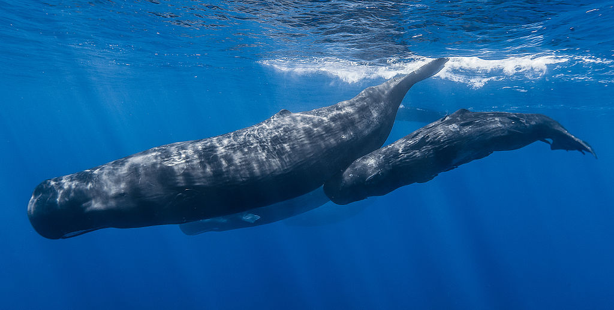

### What is a docker and why?

* Most popular containerization technology
* Puts all the code in portable packages
* Runs the code (more) safely
* Minimal overhead

### And Kubernetes matters because...

* Orchestration - runs the containers
* High availability - replication, multiple entry points
* Autoscaling - react to changing workloads
* Cloud agnostic - write once, deploy everywhere

### EVERYWHERE

* [Kops - AWS, GCE, Digital Ocean, Terraform](https://github.com/kubernetes/kops)
* [Google Kubernetes Engine](https://cloud.google.com/kubernetes-engine/)
* [Azure Kubernetes Service](https://azure.microsoft.com/en-us/services/kubernetes-service/)
* [Amazon Elastic Container Service](https://aws.amazon.com/eks/)
* [Bare Metal](https://kubernetes.io/docs/getting-started-guides/fedora/)
* [And there's more!](https://kubernetes.io/docs/setup/pick-right-solution/#hosted-solutions)

### How did we get here?

### Applications B.C. (Before Containers)

* Building
    1. Download libraries
    1. Configure environment
    1. Build application
* Running
    1. Unzip/install
    1. Configure application
    1. Run application

### Problem?

* (Lack of) Portability
* (Lack of) Isolation
* Manual Configuration

### Solutions

* Virtual machines
* Chroots/jails
* Sdk managers

{ height=256px}

[(courtesy toonpool)](https://www.toonpool.com/cartoons/cut%20corners_92504)

### Enter Containers (Docker)


[(courtesy stack overflow)](https://stackoverflow.com/a/33132462/586148)

### Docker!!!

* Images as code :)
    * [RocketChat](https://github.com/RocketChat/Docker.Official.Image/blob/294dc246d5a38b4143dbeb3435fbce501583bae7/Dockerfile)
* Isolation
* [Central repositories](https://hub.docker.com/r/bryanrosander/k8s-talk/)
* Lightweight
* Easy to spin up

```
docker run --name db -d mongo:3.0 --smallfiles
docker run --name rocketchat -p 127.0.0.1:3000:3000 --env ROOT_URL=http://localhost --link db -d rocket.chat
```

### Container Best Practices

* Small image - [multistage builds](https://docs.docker.com/develop/develop-images/multistage-build/)
* Single process - no you don't need ssh
* Compose via network links
* Config overrides via env variables (or mounted volumes)

### Docker Compose

Lets us specify declaratively which containers to run, how to link them together.

* Simple - good for local testing
* Not a great production deployment story

[See compose yaml](rocket-chat-compose/docker-compose.yaml)

### Kubernetes

Kubernetes is a cluster orchestration tool that aims to be a cloud-agnostic way to deploy applications in a scalable and fault tolerant way.

All configuration is in yaml files, can be versioned :)

Kubernetes handles configuration at the pod level and up.

### Pod

Group of containers that work together to provide a single external service


[(courtesy wikimedia)](https://commons.wikimedia.org/wiki/File:Sperm_whale_pod.jpg)

### Configuration

* Configmap - inject config files, env variables
* Secret - sensitive files and variables
* PersistentVolume - mount disks to container

### Orchestration

* Deployment - run X pods
* StatefulSet - run X pods with stable hostname, volumes
* Daemonset - run pod on each node (subject to taints)
* (Cron)Job- run pod until it has finished its work

### Disovery/Ingress:

* Service - DNS resolution/external access
* Ingress - nginx, haproxy, or native

### Isolation/Security:

* Namespace
* Network policy
* Authentication
* Authorization

### Package Management

Helm is Kubernetes' version of apt get.

[RocketChat Chart](https://github.com/helm/charts/tree/master/stable/rocketchat)

```
helm install --name rocketchat stable/rocketchat
```

### Kops

[Ok, so what if we could version our Kubernetes cluster as code? :)](https://github.com/kubernetes/kops)

### Case Studies

* [ChickFilA](https://medium.com/@cfatechblog/edge-computing-at-chick-fil-a-7d67242675e2)
* [Lots more!](https://kubernetes.io/case-studies/)

### End

* [Slides (https://goo.gl/NWK1y8)](https://brosander.github.io/k8s-talk/#/)
* [Slides source](https://github.com/brosander/k8s-talk)
* [\@bryan_rosander](https://twitter.com/bryan_rosander)
* [Blog](https://blog.rosander.ninja/)
